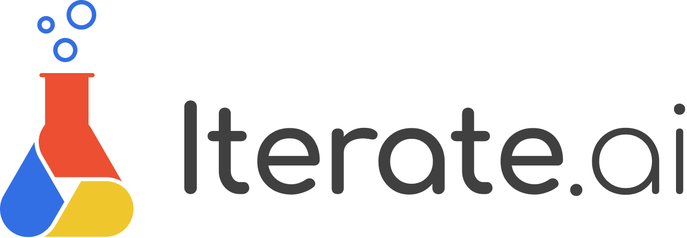

<p align="center">
  <picture>
    <source media="(prefers-color-scheme: dark)" srcset="assets/agentone-logo-white.png"/>
    
  </picture>
</p>

<h1 align="center">AgentOne Token Compression</h1>
<p align="center"><strong>by <a href="https://iterate.ai">Iterate.ai</a></strong></p>

<p align="center">
  <strong>Cut the tokens Claude ingests from tool output — ~75% overall on a mixed Claude Code workload (big on JSON, Bash, Grep and repetitive logs; little on prose or varied logs). Dropped code bodies recoverable via on-demand retrieve. Drop-in. Zero-config. Runs locally.</strong>
</p>

<p align="center">
  
  
  
  
  
</p>

<p align="center">
  Works in: <strong>Claude Code</strong> · <strong>Claude CLI</strong> · <strong>Claude Desktop</strong><br/>
  Part of the <a href="https://iterate.ai/agentone">AgentOne</a> platform.
</p>

---

## What it does

Every time Claude reads a file, runs `Bash`, executes `Grep`, fetches a URL, or you paste a chunk of content, those tokens enter Claude's context and get billed on every subsequent turn. **AgentOne Token Compression intercepts content at the point of insertion** and compresses it so the bill — and the context pressure — stays low. Savings are **highly content-dependent**: large on verbose or repetitive tool output (JSON, `Bash`/`Grep` results, near-identical log lines) and **small on prose or logs where every line differs**. On the mixed benchmark workload below the overall reduction is **~75%**. Dropped code bodies are **recoverable via on-demand `retrieve`**.

> Measured with the plugin's benchmark harness (ships in the development source repo). See the [Benchmarks](#benchmarks) section for the raw output.

```
┌─────────────────────────────────────────────────────────────────┐
│  Read on big JSON file        8.9 kB  →   1.3 k tokens  ⚡ 40%   │
│  Bash output (npm install)    5.9 kB  →     161 tokens  ⚡ 89%   │
│  Grep on codebase             4.1 kB  →     152 tokens  ⚡ 88%   │
│  WebFetch HTML page           2.2 kB  →     364 tokens  ⚡ 47%   │
│  Long log file *              6.8 kB  →       0 tokens  ⚡ 100%  │
│                                                                 │
│  Overall:  8.0 k tokens  →  2.0 k tokens   ⚡ 75% saved          │
│  Hook latency: ~66 ms                                           │
└─────────────────────────────────────────────────────────────────┘
```
\* Best case: **near-identical** log lines. Logs with unique per-line values
(timestamps, request ids) compress far less — sometimes ~0%.

It also caches every tool result and prompt, so a repeat read of the same file (or a near-identical prompt) returns the **same compressed form quickly** without recomputing it — a cache hit saves the recompute work (~7–8% additional token savings on re-reads), not 100% of the tokens.

---

## Three ways to use it

| Surface | Mode | Auto-compresses? |
|---|---|---|
| **Claude Code** (TUI) | Hooks via `~/.claude/settings.json` | ✅ Yes — every tool call |
| **Claude CLI** | Same hooks as Claude Code | ✅ Yes — every tool call |
| **Claude Desktop** | MCP server | On-demand (Claude calls the tools) |

---

## Quick install

### Claude Code — plugin marketplace (recommended)

```
/plugin marketplace add IterateAI/compression
/plugin install agentone-token-compression@iterate-ai
```

Restart Claude Code. Hooks auto-compress every tool call — no further setup.

### Claude Code & CLI (npm — alternative)

```bash
npm install -g @iterate/agentone-token-compression
agentone-tc install
```

Restart Claude Code. Done.

### Claude Desktop (MCP server via npx — on-demand)

Add to your `claude_desktop_config.json`:

```json
{
  "mcpServers": {
    "agentone-token-compression": {
      "command": "npx",
      "args": ["-y", "@iterate/agentone-token-compression", "mcp"]
    }
  }
}
```

`npx -y` fetches the package on first run; no global install needed. Fully quit Claude Desktop and relaunch.

Config file location: `~/Library/Application Support/Claude/claude_desktop_config.json` (macOS), `%APPDATA%\Claude\claude_desktop_config.json` (Windows), `~/.config/Claude/claude_desktop_config.json` (Linux).

Detailed Desktop instructions: **[INSTALL_DESKTOP.md](INSTALL_DESKTOP.md)**.
All distribution options (marketplace, source clone, release tarball): **[DISTRIBUTION.md](DISTRIBUTION.md)**.

### Verify install

```bash
agentone-tc doctor    # 9-check diagnostic
agentone-tc desktop   # print the JSON snippet for Claude Desktop config
```

---

## Status line (optional)

The live savings bar — `⚡ AgentOne TokenOptimizer by Iterate.ai saved … tokens · … · … cache hits` — is a Claude Code **`statusLine`** setting, **not** a plugin feature: Claude Code plugins cannot register a status line, so a marketplace install doesn't set it up automatically. To enable it, add this to `~/.claude/settings.json` (this form resolves the newest installed version, so it keeps working across updates):

```json
{
  "statusLine": {
    "type": "command",
    "command": "node \"$(ls -d $HOME/.claude/plugins/cache/iterate-ai/agentone-token-compression/*/dist/hooks/statusline.js | sort -V | tail -1)\""
  }
}
```

Restart Claude Code and the bar appears. (The npm/CLI install path — `agentone-tc install` — configures this for you automatically.)

---

## Commands and tools

### Slash commands (Claude Code + CLI)

| Command | What it does |
|---|---|
| **`/optimize_dashboard`** | 📊 Read-only dashboard: stats, config, $ saved, optimization tips |
| **`/optimize`** [`auto`] | 🎯 Analyze usage + recommend (or auto-apply) config improvements |
| `/tokens` | Lifetime stats + cost savings |
| `/compress <text or file>` | Manually compress + show before/after |
| `/tokens-config key=value` | View / update configuration |
| `/tokens-reset cache\|stats\|all` | Clear caches and/or stats |
| `/tokens-off` / `/tokens-on` | Temporarily disable / re-enable |

### MCP tools (Claude Desktop)

Same capabilities, called as tools. Claude invokes them on demand (the bundled skill teaches it when).

| Tool | What it does |
|---|---|
| **`compress`** | Compress arbitrary text + return stats |
| **`analyze`** | Detect content type, estimate savings without modifying |
| **`optimize`** | Analyze usage + return recommendations (and optionally apply) |
| `stats` | Lifetime savings + $ saved breakdown |
| `clear_cache` | Reset caches or stats |

Ask Claude in Desktop: *"Use the AgentOne optimize tool to find ways I could save more tokens"* — Claude calls the tool, surfaces the recommendations, and (if you ask) applies them.

---

## How it works

When Claude Code runs a tool, this plugin intercepts the result via a **PostToolUse hook** and routes it through Iterate.ai's mask-union optimization pipeline:

```
tool result
  │
  ▼
[Cache lookup]  ─────► hit?  return cached compressed form  (skips recompute)
  │ miss
  ▼
[Content router]
  ├── JSON  → minify + null-strip + array-collapse + string-dedup
  ├── Log   → mask volatile fields + collapse repeats
  ├── Code  → comment/blank-line strip (docstrings & signatures kept). AST body-drop
  │           is available but OPT-IN and only safe with a retrieval path (see below)
  ├── HTML  → strip comments/scripts/styles + whitespace
  ├── Bash  → aggressive line-collapse with semver/path/ID masking
  ├── Grep  → template-collapse identical-shaped matches
  └── prose → whitespace + (opt-in) abbreviation
  │
  ▼
[Mask-union safety pass]
  ├── entropy ≥ 0.85 multi-class → preserve     (UUIDs, hashes, base64)
  ├── pattern match               → preserve     (sk-, sk-ant-, AKIA, JWT, PEM)
  ├── URL                         → preserve     (https://…)
  └── long-number ID              → preserve     (10+ digit)
  │
  ▼
compressed result + cache insert + stats update
  │
  ▼
returned to Claude with footnote: "[AgentOne TokenOptimizer by Iterate.ai: 8,932 → 1,340 tokens (~85% saved)]"
```

**Critical guarantee (credentials & URLs):** API keys (`sk-`, `sk-ant-`), AWS keys (`AKIA…`), JWTs (`eyJ…`), PEM blocks, and URLs are **never modified, masked, or dropped** — in *any* mode, including line-heavy log collapse. This is enforced independently of the compression pipeline (a dedicated protected-pattern guard in the tool-output hook, on top of the mask-union architecture).

**Lossy by design (logs):** In log / line-heavy output, *volatile identifiers* — timestamps, numeric request IDs, UUIDs, and hashes — may be **templated or collapsed** to fold many near-identical lines into one (that's the whole point of log compression). If you need every such value preserved verbatim, disable line-heavy compression via `/tokens-config`. Credentials and URLs (above) are never touched regardless.

---

## What runs standalone vs. what needs a gateway

This plugin runs Claude Code / CLI in **hooks mode** — every hook is a separate,
short-lived Node process with no access to the real provider request or provider
cache telemetry. That shapes which parts of the compression IP are active:

| Capability | Standalone Claude Code (this plugin) | Requires a gateway |
|---|---|---|
| **Spec 1 — real token reduction** | ✅ Active. The PostToolUse hook replaces the tool result via `updatedToolOutput`, so compression actually reduces the tokens Claude processes (not just an appended note). | — |
| **Spec 3 — prefix-resident dictionary** | ✅ Active, **lossless per output.** Recurring long strings are replaced with short codes, and a model-decodable `[dictionary]` glossary is emitted **inline in the same output**, so the replacement stays self-decoding with no external lookup. *Limitation:* the codebook is not persisted across the stateless hook processes (the library codec keeps it in memory), so codes are mined per output rather than shared across invocations. | Cross-request codebook persistence + prefix-cache reuse. |
| **Spec 4 — closed-loop governor** | ✅ Active, **reduced-signal.** A multi-armed bandit picks a compression level per (namespace, content-type), with arms **persisted to disk** (`data/governor-arms.json`) so learning survives across hook processes. Reward is driven by the signals a hook can actually observe — **token savings** and **tokenGuard revert**. Signals a hook cannot see (shadow-eval, retrieval-miss, retry) are left at neutral defaults, so the loop degrades gracefully rather than acting on fabricated data. | Full-signal reward (shadow-eval quality scoring, retrieval-miss, retry rates). |
| **Spec 2 — cache-economics markers/telemetry** | ❌ **Off.** Marker placement and TTL economics need control of the real request **and** provider `usage.cache_*` telemetry. A hook builds a synthetic single-message request and never sees that telemetry, so the scheduler would have no signal — enabling it would be inert. We leave it off rather than imply a capability the hook can't deliver. | ✅ A gateway that owns the request and reads provider cache telemetry. |

**Safety cap (irreversibility).** In hooks mode there is **no standalone retrieval
path** — Claude Code does not register this plugin's MCP `retrieve`-style tool, so a
dropped span cannot be fetched back. Because `updatedToolOutput` replacement is now a
real, irreversible substitution, the governor's most-aggressive level is **capped**:
no level engages AST function-body drop or any lossy-without-retrieval pass. Aggression
is limited to bounded/self-decoding transforms — whitespace, JSON minify/tabular,
bounded log head+tail collapse, prose abbreviation, and dictionary substitution with its
inline glossary. AST body-drop remains available for gateway deployments that expose a
retrieval tool.

---

## Privacy & safety

- **100% local.** Nothing leaves your machine. No telemetry, no network calls.
- **Caches live at**: `~/.claude/plugins/agentone-token-compression/data/`. Inspect or delete anytime.
- **Secrets protected by construction.** Pattern + entropy detectors run before any rewrite.
- **Disable instantly**: `export TOKEN_OPTIMIZER_DISABLED=1` in your shell, or `/tokens-off`.
- **Never crashes a session.** Every hook fails open: if anything goes wrong, the tool output passes through untouched.
- **Proprietary, free for commercial use.** © Iterate.ai — see [LICENSE](LICENSE). Includes Apache-2.0 components; see [THIRD-PARTY-NOTICES.md](THIRD-PARTY-NOTICES.md).

---

## Cost calculator

At Anthropic's published rates:
- **Claude Opus**: $15 / 1M input tokens
- **Claude Sonnet**: $3 / 1M input tokens
- **Claude Haiku**: $0.80 / 1M input tokens

If you save **~75% of input tokens** (this benchmark's mixed workload — your real number depends heavily on content mix) on **5M input tokens / month**:

| Model | Original | With AgentOne | Saved |
|---|---:|---:|---:|
| Opus | $75/mo | $18.75/mo | **$56.25/mo** ($675/yr) |
| Sonnet | $15/mo | $3.75/mo | **$11.25/mo** ($135/yr) |
| Haiku | $4/mo | $1.00/mo | **$3.00/mo** ($36/yr) |

For a team of 10 engineers on Opus: **~$6,750/year** at this savings rate.

---

## Configuration

`/tokens-config key=value` or edit `~/.claude/plugins/agentone-token-compression/data/config.json`:

| Key | Default | Effect |
|---|---|---|
| `exactCache.enabled` | `true` | Exact-match cache (zero false positives) |
| `exactCache.ttlMs` | `604800000` (7d) | Cache entry TTL |
| `semanticCache.enabled` | `true` | Fuzzy similarity cache |
| `semanticCache.threshold` | `0.92` | Lower = more hits, more false positives |
| `pipeline.contentRouter.codeMode` | `'comments'` | `'ast'` = AST body-drop on code. **Capped off in standalone hooks mode** (no retrieval path); active only with a gateway that exposes `retrieve`. |
| `pipeline.abbreviation.enabled` | `false` | Phrase abbreviation (off by default) |
| `pipeline.entropyProtection.enabled` | `true` | Safety: protect API keys, UUIDs, hashes |
| `pipeline.dedupe.enabled` | `true` | Message-level dedupe |

Or just run **`/optimize`** and let AgentOne pick the best settings for your usage pattern.

---

## Benchmarks

Measured with the plugin's benchmark harness (`test/benchmark.js`, in the development source repo — not shipped in the compiled plugin). Latest run:

```
Token Optimizer Plugin — Hook Benchmark
========================================
  Read on big JSON file         8.9kB →  1.3k tok (40% saved, 68ms)
  Bash output (npm install)     5.9kB →   161 tok (89% saved, 68ms)
  Grep on codebase              4.1kB →   152 tok (88% saved, 67ms)
  WebFetch HTML page            2.2kB →   364 tok (47% saved, 66ms)
  Long log file                 6.8kB →     0 tok (100% saved, 63ms)

--- Cache hit re-run (same payloads) ---
  All ✓ cache hit (~60ms each)

=== Overall ===
  Tokens before: 8.0k → after: 2.0k → Saved 75.1%   ·   Avg latency 66ms
```

The log fixture is **near-identical lines** (best case). Real logs with unique
per-line values compress far less. There is no source-code row here: AST
body-drop (the main code lever) is **capped off in standalone hooks mode** — see
[What runs standalone vs. what needs a gateway](#what-runs-standalone-vs-what-needs-a-gateway).

---

## Architecture

Thin Claude integration layer over [`@iterate/token-optimizer`](../nodejs_optimizer), a production compression library implementing:

- **Mask-union pattern** (Iterate.ai's mask-union compression architecture) — composable boolean masks from independent detectors
- **Entropy-based protection** — Shannon entropy + multi-class detection of UUIDs, keys, hashes
- **CCR (Compress, Cache, Retrieve)** — hash-keyed LRU + reversible markers + retrieval tool
- **CacheAligner** — moves volatile bits out of system prompts for provider prefix-cache stability
- **Semantic cache** — MinHash + token cosine (optional embedding hook)
- **Pluggable content detector** — drop in Magika or any classifier
- **AST body-drop** — Python via stdlib `ast`, JS/TS via brace-balanced regex
- **JSON array-depth compression**, **log template-collapse**, **HTML strip**, **abbreviation rules**, **history compaction**, **smart truncation**

Library tests: **183 passing** (Node.js) + **172 passing** (Python).
Plugin tests: **51 passing** end-to-end (hooks, MCP, reversible-AST, spec-wiring, release-hardening).

---

## Uninstall

```bash
bash ~/.claude/plugins/agentone-token-compression/scripts/uninstall.sh
```

Removes plugin files, slash commands, skill, and hook entries from `settings.json`. Caches are preserved at `~/.claude/plugins/agentone-token-compression/data/` so you can re-enable later without losing savings.

For Claude Desktop, also remove the `agentone-token-compression` entry from `claude_desktop_config.json` and restart Claude Desktop.

---

## Troubleshooting

**"Plugin doesn't seem to do anything" (Claude Code)**
→ Restart Claude Code. Hooks only load at session start.
→ Run `/optimize_dashboard` — if you see lifetime stats accumulating, it's working.

**"MCP server not showing up" (Claude Desktop)**
→ Fully quit (Cmd-Q on macOS) and relaunch Claude Desktop.
→ Verify the path in `claude_desktop_config.json` is absolute and node is on `PATH` for GUI apps. On macOS try `"command": "/opt/homebrew/bin/node"`.

**"Status line is empty" or missing**
→ The status line is a Claude Code `statusLine` **setting**, not a plugin feature (plugins can't register one) — marketplace installs must add it manually. See [Status line (optional)](#status-line-optional). If you already have a `statusLine`, merge ours in or keep yours.

**"It compressed something I needed verbatim"**
→ Disable per-hook: edit `~/.claude/settings.json`, remove the specific tool from `matcher`.
→ Or globally: `/tokens-off`.

---

## Contributing

PRs welcome. Especially:
- Real-world fixtures (Bash/Grep outputs that don't compress well) — help us tune the masking patterns
- More content-type detectors (Ruby, Elixir, Clojure)
- Additional MCP tools

---

## About Iterate.ai

<p align="left">
  <picture>
    <source media="(prefers-color-scheme: dark)" srcset="assets/iterate-logo-white.png"/>
    
  </picture>
</p>

[Iterate.ai](https://iterate.ai) is an enterprise AI application platform for deploying secure, private AI assistants and agents — on‑premises, in private cloud, or at the edge — with full data ownership and IP protection, on a **Build → Run → Govern** model.

AgentOne Token Compression is part of the **[AgentOne](https://iterate.ai/agentone)** family — Iterate.ai's secure, AI‑assisted development environment for enterprise teams. Related products:

- **[AgentWatch](https://iterate.ai/applications/agentwatch)** — AI governance, monitoring, policy enforcement, and spend control
- **[Generate](https://iterate.ai/platform/generate)** — private AI assistants and task agents over enterprise knowledge
- **Interplay** — low‑code platform for building and scaling agentic AI workflows
- **Extract** — document AI for classifying and structuring unstructured content
- **Lifeboat** — private AI inference engine for runtime performance and cost

---

## License

**Copyright © 2026 Iterate.ai. All rights reserved.** Free to use for commercial purposes.

For advanced compression and coding harness engines, contact **[iterate.ai/contact](https://iterate.ai/contact)**.

See [LICENSE](LICENSE) for full terms. This product includes components derived from third-party open-source software (notably the Apache-2.0 licensed [Headroom](https://github.com/chopratejas/headroom) project); those components remain under their original licenses — see [THIRD-PARTY-NOTICES.md](THIRD-PARTY-NOTICES.md).

---

<p align="center">
  Made with care by <a href="https://iterate.ai">Iterate.ai</a> · part of the
  <a href="https://iterate.ai/agentone">AgentOne</a> platform · alongside
  <a href="https://iterate.ai/applications/agentwatch">AgentWatch</a> and
  <a href="https://iterate.ai/platform/generate">Generate</a>
</p>
